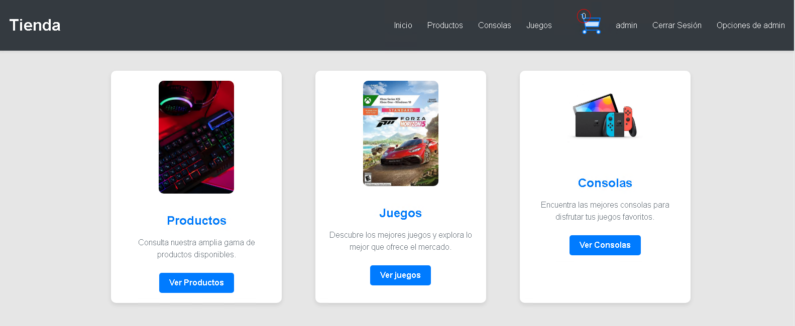
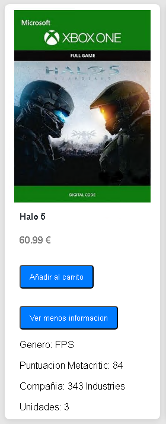
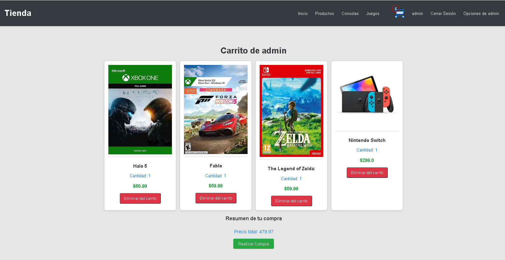
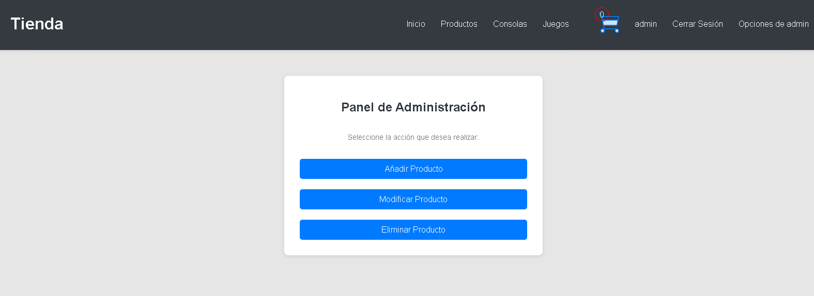
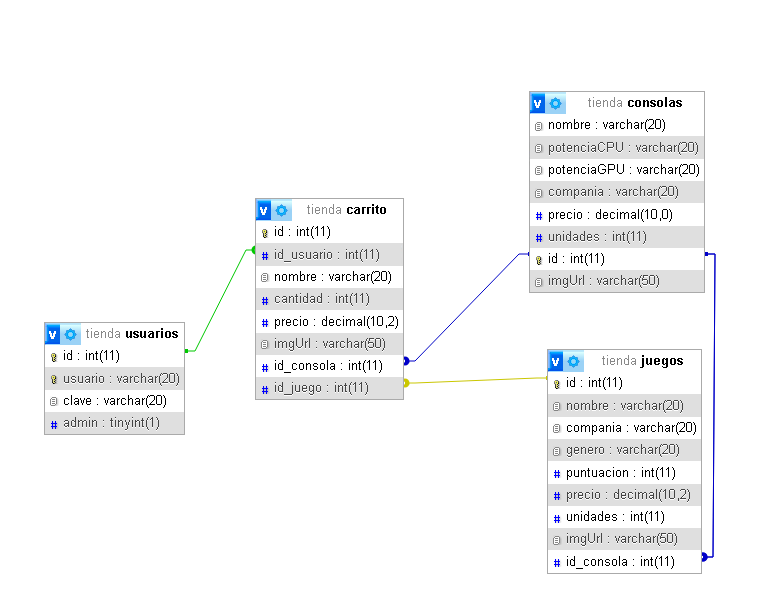

# Gestión de Stock de Videojuegos

## Descripción del Proyecto

Este proyecto es una aplicación web que gestiona el stock de una tienda de videojuegos. La aplicación permite a los usuarios consultar información sobre consolas, su catálogo de juegos y gestionar el stock de productos.

  

## Tecnologías Utilizadas

- **HTML**: Para la estructura de la aplicación web.
- **CSS**: Para el diseño y estilo visual.
- **Java**: Lenguaje de programación principal.
- **Servlets**: Para manejar las solicitudes y respuestas en la aplicación.
- **MySQL**: Base de datos para almacenar información sobre consolas, juegos y stock.
- **Tomcat**: Servidor de aplicaciones para desplegar la aplicación web.

## Funcionalidades

La aplicación permite realizar las siguientes tareas:

1. **Consultar el catálogo de juegos de cada consola**:
   - Nombre del juego
   - Compañía desarrolladora
   - Género del juego
   - Puntuación en Metacritic
   - Precio
   - Unidades disponibles

2. **Consultar el catálogo total de juegos de la tienda**:
   - Nombre del juego
   - Plataforma (nombre de la consola)
   - Compañía desarrolladora
   - Género del juego
   - Puntuación en Metacritic
   - Precio
   - Unidades disponibles

3. **Consultar todos los productos**:
   - Nombre del producto e informacion general
   - Precio
   - Cantidad de unidades disponibles
  

  

4. **Comprar productos**: Opción para comprar un producto, reduciendo la cantidad disponible en uno, siempre que haya al menos una unidad disponible.

  

6. **Gestión del Stock (solo para administradores)**:
   - Modificar la información de cualquier producto.
   - Insertar nuevos productos.
   - Eliminar productos.
  

  

## Requisitos

- Tener un servidor Tomcat configurado para desplegar la aplicación.
- Conexión a una base de datos MySQL para almacenar la información de las consolas, juegos y productos. importando la base de datos de Import DB/ControlTienda.sql. Esperando el siguiente resultado

  

## Instalación

1. Clona este repositorio.
2. Configura la base de datos MySQL con el import sql.
3. **Descargar la librería MySQL Connector 9.0.0**:  
   Puedes descargarla desde el siguiente enlace: [MySQL Connector 9.0.0](https://downloads.mysql.com/archives/c-j/)
4. Descarge el tomcat del siguiente enlace [Tomcat 11.0.2](https://tomcat.apache.org/download-11.cgi)
5. Despliega la aplicación en el servidor Tomcat.

## Licencia

Este proyecto está licenciado bajo la Licencia MIT. Consulta el archivo [LICENSE](LICENSE) para más detalles.

## Aclaración

Las imágenes utilizadas en este proyecto no me pertenecen y son propiedad de sus respectivos autores.

## Contribuir al Proyecto
Para conocer cómo contribuir, revisa nuestras [pautas de contribución](https://github.com/sam324sam/sam324sam/blob/main/CONTRIBUTING.md).

